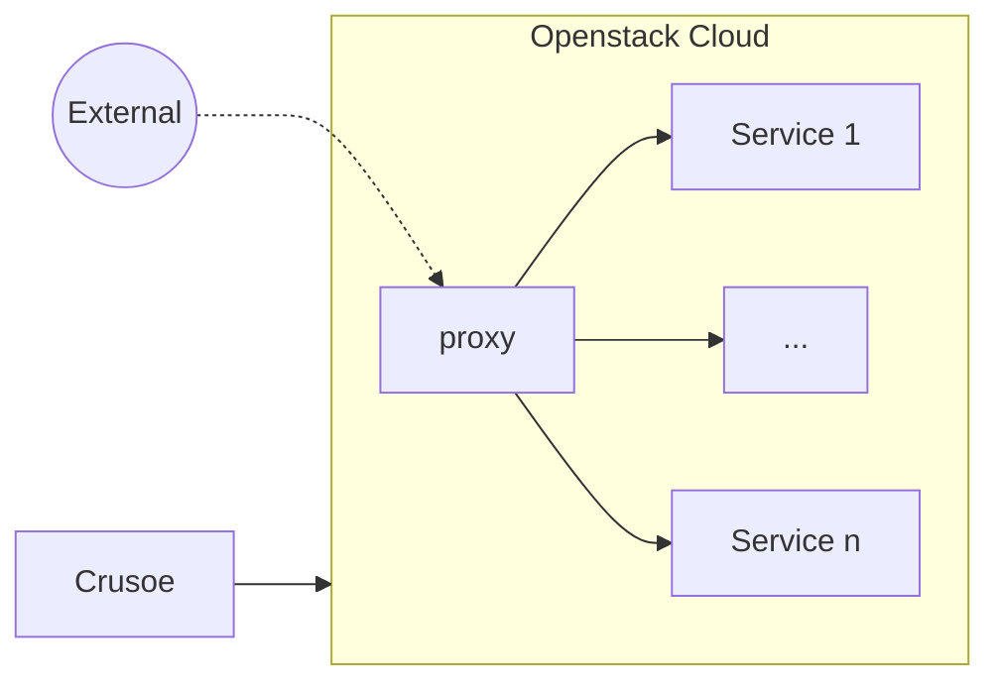

# Crusoe

Crusoe is developed as a simple command-line interface tool to provide a cloud infrastructure as code. Its main use case is to automate the deployment of multiple services on a de.NBI Cloud OpenStack project in a lightweight way. 

The infrastructure is described in a simple configuration file: 

```yml
subnet: #name of your subnet
floating_ip: #your public IP address

sshKey: #name of your SSH key

instances:
  - name: #human readable name 
    image: #name or id of the image 
    type: #name or id of the flavor
```

To create the infrastructure run `crusoe start`. To get more details about the creation process run in verbose mode with `crusoe -v start`.


